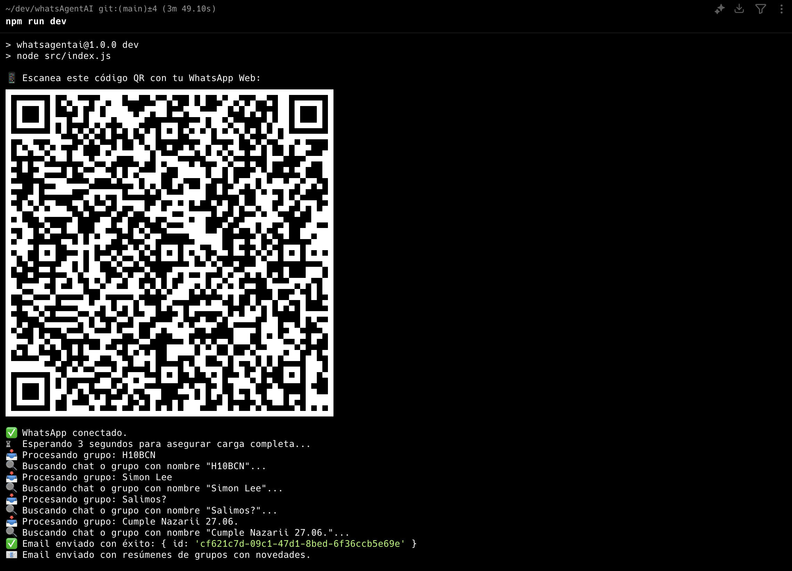

<!--
Hey, thanks for using the awesome-readme-template template.  
If you have any enhancements, then fork this project and create a pull request
or just open an issue with the label "enhancement".

Don't forget to give this project a star for additional support ;)
Maybe you can mention me or this repo in the acknowledgements too
-->

<div align="center">
  
  <p>
    A WhatsApp automation bot that summarizes your group messages using ChatGPT and sends the digest via email.
  </p>

<!-- Badges -->

<p>
  <a href="https://github.com/diegotorreslopez81/whatsAgentAI/graphs/contributors">
    
  </a>
  <a href="https://github.com/diegotorreslopez81/whatsAgentAI">
    
  </a>
  <a href="https://github.com/diegotorreslopez81/whatsAgentAI/network/members">
    
  </a>
  <a href="https://github.com/diegotorreslopez81/whatsAgentAI/stargazers">
    
  </a>
  <a href="https://github.com/diegotorreslopez81/whatsAgentAI/issues/">
    
  </a>
  <a href="https://github.com/diegotorreslopez81/whatsAgentAI/blob/main/LICENSE">
    
  </a>
</p>

<h4>
  <a href="https://github.com/diegotorreslopez81/whatsAgentAI/issues/">Report Bug</a>
  <span> · </span>
  <a href="https://github.com/diegotorreslopez81/whatsAgentAI/issues/">Request Feature</a>
</h4>
</div>

<br />

## \:star2: About the Project

WhatsAgentAI is a WhatsApp automation script that reads the latest messages from selected WhatsApp groups or chats, summarizes them using OpenAI, and emails the digest using Resend. Ideal for staying informed without being overwhelmed by notifications.

---

## \:camera: Screenshots

<div align="center">
  
</div>

---

## \:space\_invader: Tech Stack

<details>
  <summary>Backend</summary>
  <ul>
    <li>Node.js</li>
    <li>whatsapp-web.js</li>
    <li>OpenAI API</li>
    <li>Resend API</li>
  </ul>
</details>

---

## \:dart: Features

* ✅ Automatically reads latest WhatsApp group messages
* 🤖 Uses ChatGPT to summarize discussions
* 📧 Sends email digest via Resend
* 🔁 Avoids duplicate emails with hash comparison
* ⚙️ Easily configurable via environment variables

---

## \:key: Environment Variables

Create a `.env` file with the following:

```env
OPENAI_API_KEY=your_openai_api_key
RESEND_API_KEY=your_resend_api_key
EMAIL_FROM=noreply@resend.dev
EMAIL_TO=you@example.com
IGNORE_REPEAT=false
GROUPS=Group1,Group2,Another Chat
```

---

## \:toolbox: Getting Started

### \:bangbang: Prerequisites

Install Node.js and npm/yarn:

```bash
brew install node # MacOS
```

---

### \:gear: Installation

```bash
git clone https://github.com/diegotorreslopez81/whatsAgentAI.git
cd whatsAgentAI
npm install
```

---

### \:running: Run Locally

```bash
npm run dev
```

Scan the QR code with WhatsApp Web on your phone.

---

## \:triangular\_flag\_on\_post: Deployment

Deploy on Railway:

1. Connect your GitHub repo
2. Set environment variables in Railway dashboard
3. Create a Cron Job → Schedule it to run every 12h:

```bash
node src/index.js
```

---

## \:eyes: Usage

* Edit `.env` to define WhatsApp groups
* Start the script
* Check your email inbox for summaries

---

## \:compass: Roadmap

* [x] Email summaries via Resend
* [x] Add group list to `.env`
* [ ] Web UI

---

## \:wave: Contributing

PRs are welcome! Feel free to fork and submit changes.

---

## \:scroll: Code of Conduct

Follow GitHub’s standard [Code of Conduct](https://docs.github.com/en/site-policy).

---

## \:grey\_question: FAQ

* **Does it work with private chats?** Yes.
* **Does it store messages?** No, only hashes.

---

## \:warning: License

MIT License.

---

## \:handshake: Contact

Created by [@diegotorreslopez81](https://github.com/diegotorreslopez81) · [diego@infinitelabs.co](mailto:diego@infinitelabs.co)

---

## \:gem: Acknowledgements

* [whatsapp-web.js](https://github.com/pedroslopez/whatsapp-web.js)
* [OpenAI API](https://openai.com)
* [Resend](https://resend.com)
